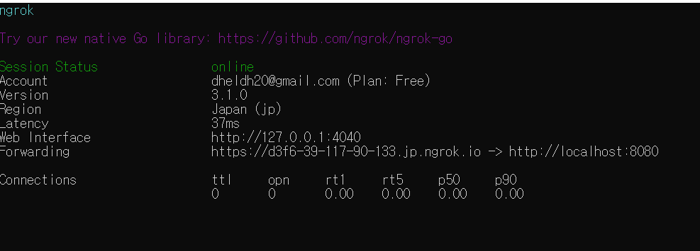

## android http로 api 쏘는 방법

1. ngrok 설치

2. 원하는 로컬 호스트 (ex 8080) 이면 다음과 같은 명령어

   `ngrok 8080 http`

3. 다음과 같이 https:를 경유하는 것을 볼 수 있다.

   


## Fast API json 받는 방법

`uvicorn auth_image:app --reload` = 실행

1. 정확한 자료형을 주지 않으면 `422err`가 나버린다.

2. 예를 들어 

   ```python
   from pydantic import BaseModel
   
   class Hi(BaseModel):
       image: str
   
   @app.post("/")
   async def root(data: Hi):
       return {"message": "Hello World"}
   ```

3. 위와 같이 형태를 명료하게 표현해 줘야한다.