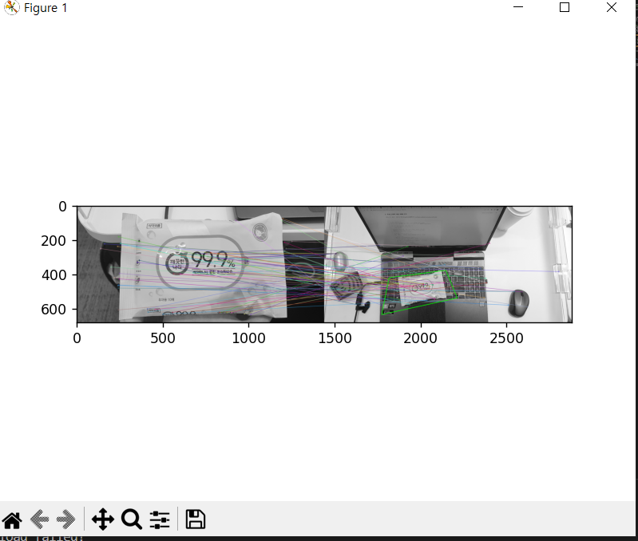

현재 몇 가지 알고리즘을 비교하여 가장 신뢰성이 높아 보이는 것을 가져와서 이용해야 할 듯

1. FLANN based Matcher
2. Brute-Force Matching with ORB Descriptors
3. Brute-Force Matching with SIFT Descriptors and Ratio Test

`https://docs.opencv.org/4.x/dc/dc3/tutorial_py_matcher.html`


이 후 호모그래피를 활용하여 다양한 각도의 물건을 감지

`https://deep-learning-study.tistory.com/262?category=946336`


사각형의 넓이를 구하여 일정 이하의 경우 없는 것으로 간주한다.

전체 코드는 다음과 같다.

```python
import matplotlib.pyplot as plt
import cv2, numpy as np
import sys

def explode_xy(xy):
    xl=[]
    yl=[]
    for i in range(len(xy)):
        xl.append(xy[i][0])
        yl.append(xy[i][1])
    return xl,yl

def shoelace_area(x_list,y_list):
    a1,a2=0,0
    x_list.append(x_list[0])
    y_list.append(y_list[0])
    for j in range(len(x_list)-1):
        a1 += x_list[j]*y_list[j+1]
        a2 += y_list[j]*x_list[j+1]
    l=abs(a1-a2)/2
    return l


# 영상 불러오기
src1 = cv2.imread('t2.jpg', cv2.IMREAD_GRAYSCALE)
src2 = cv2.imread('cat.jpg', cv2.IMREAD_GRAYSCALE)

if src1 is None or src2 is None:
    print('Image load failed!')
    sys.exit()

# 특징점 알고리즘 객체 생성 (KAZE, AKAZE, ORB 등)
# feature = cv2.KAZE_create() # 기본값인 L2놈 이용
feature = cv2.AKAZE_create()
#feature = cv2.ORB_create()

# 특징점 검출 및 기술자 계산
kp1, desc1 = feature.detectAndCompute(src1, None)
kp2, desc2 = feature.detectAndCompute(src2, None)

# 특징점 매칭
matcher = cv2.BFMatcher_create()
matches = matcher.match(desc1, desc2)

# 좋은 매칭 결과 선별
matches = sorted(matches, key=lambda x: x.distance)
good_matches = matches[:80]

print('# of kp1:', len(kp1))
print('# of kp2:', len(kp2))
print('# of matches:', len(matches))
print('# of good_matches:', len(good_matches))

# 호모그래피 계산
# DMatch 객체에서 queryIdx와 trainIdx를 받아와서 크기와 타입 변환하기
pts1 = np.array([kp1[m.queryIdx].pt for m in good_matches]
				).reshape(-1, 1, 2).astype(np.float32)
pts2 = np.array([kp2[m.trainIdx].pt for m in good_matches]
				).reshape(-1, 1, 2).astype(np.float32)
                
H, _ = cv2.findHomography(pts1, pts2, cv2.RANSAC) # pts1과 pts2의 행렬 주의 (N,1,2)
# 호모그래피를 이용하여 기준 영상 영역 표시
dst = cv2.drawMatches(src1, kp1, src2, kp2, good_matches, None,
                      flags=cv2.DRAW_MATCHES_FLAGS_NOT_DRAW_SINGLE_POINTS)

(h, w) = src1.shape[:2]

# 입력 영상의 모서리 4점 좌표
corners1 = np.array([[0, 0], [0, h-1], [w-1, h-1], [w-1, 0]]
                    ).reshape(-1, 1, 2).astype(np.float32)


# 입력 영상에 호모그래피 H 행렬로 투시 변환
corners2 = cv2.perspectiveTransform(corners1, H)

# corners2는 입력 영상에 좌표가 표현되있으므로 입력영상의 넓이 만큼 쉬프트
corners2 = corners2 + np.float32([w, 0])

# 다각형 그리기
cv2.polylines(dst, [np.int32(corners2)], True, (0, 255, 0), 2, cv2.LINE_AA)
area = corners2.tolist()
print(area, type(area[0]))
print(area[0][0])
sqs = []
for p in range(4):
    sqs.append(area[p][0])

xy_e=explode_xy(sqs)
A=shoelace_area(xy_e[0],xy_e[1])
print(A)
plt.imshow(dst,),plt.show()
cv2.waitKey()
cv2.destroyAllWindows()
```




### 의문점

풍경이 같다면 결국엔 사물을 인식하는 것이 아니라 풍경끼리 비교해 버리니 정해진 사물을 인증한다는 의미가 사라질 듯 하다. 일정 크기 이상으로 사물을 찍도록 유도해야 할 듯하다.