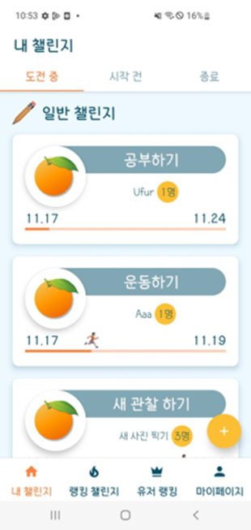

# 시연 시나리오

- 오랭지 서비스는 크게 네 가지의 탭으로 구성되어 있으며, 이에 해당하지 않는 특수 페이지들이 추가되어 있는 구조입니다.
- .으로 구분된 번호에서는 네 가지 탭들을 이용하는 방법을 소개하고, )로 구분된 번호에서는 특수 페이지들을 이용하는 방법을 소개합니다.

## 1. 내 챌린지

- 내 챌린지 탭 에는 도전 중, 시작 전, 종료 세 개의 탭이 있습니다.
- 각 탭에는 현재 진행 중인 챌린지의 목록, 참여는 했으나 시작 시간이 도래하지 않은 챌린지의 목록, 기간이 종료된 챌린지의 목록을 확인할 수 있습니다.
- 목록에 나열된 항목 중 하나를 클릭하면, 해당 챌린지의 룸으로 이동할 수 있습니다.
- 좌측 사진
  - 도전 중인 챌린지의 각 항목에서는, 챌린지의 주제, 팀의 이름, 현재 참여 인원 수, 시작 / 끝 날짜와 현재 얼마만큼의 기간이 지났는지를 알 수 있습니다.
- 우측 사진
  - 시작 전 챌린지의 각 항목에서는, 챌린지의 주제, 팀의 이름, 현재 참여 인원 수, 시작까지 얼마만큼의 날짜가 남았는지를 알 수 있습니다.

- 종료된 챌린지 목록에서는, 유저가 수행했던 모든 챌린지에 대한 통계와, 각 챌린지에 대한 기록을 확인할 수 있습니다.
- 상위 표에서는, 지금까지 참여한 챌린지의 횟수, 챌린지 별 평균 달성률, 챌린지에 참여해서 얻은 누적 점수를 알려줍니다.
- 아래 리스트의 각 항목에서는, 챌린지의 주제와 날짜, 내 달성률과 팀 달성률을 알 수 있습니다.

## 2. 랭킹 챌린지

- 랭킹 챌린지 탭에는 진행 중인 랭킹 챌린지 탭과 참여 신청을 받고 있는 랭킹 챌린지 탭이 있습니다.
- 진행 중인 랭킹 챌린지 리스트의 항목을 클릭하면, 현재 그 챌린지를 진행 중인 그룹들을 볼 수 있습니다.
- 참여 신청중인 랭킹 챌린지 리스트의 항목을 클릭하면, 랭킹 챌린지 디테일 페이지로 넘어가서 랭킹 챌린지의 자세한 설명을 볼 수 있습니다.

### 1) 랭킹 챌린지 디테일 페이지

- 랭킹 챌린지 디테일 페이지에서는 각 랭킹 챌린지에 대한 상세한 정보를 얻을 수 있습니다.
- 좌우 스크롤을 통해 각 랭킹 챌린지 상세 정보 사이를 이동할 수 있습니다.
- 하단의 챌린지 팀 만들기 버튼을 누르면, 챌린지 생성 페이지로 이동할 수 있습니다.

### 2) 챌린지 생성 페이지

- 챌린지 그룹을 생성하는 방법은 두 가지가 있습니다.
  
  1. 랭킹 챌린지
     - 디테일 페이지에서, 챌린지 팀 만들기 버튼 클릭
     - 랭킹 챌린지를 생성할 때는, 기간이나 목표 등이 이미 특정되어 있기 때문에 아래 입력 과정 중 일부가 생략됩니다
  2. 유저 챌린지
     - 내 챌린지에서 화면 우측 하단의 + 버튼을 누른 후, 새 챌린지 생성 클릭

- 챌린지 생성은 다음과 같은 순서로 진행됩니다.
  
  - 챌린지 생성 중 챌린지 생성 취소 버튼을 누르면 언제든지 이전 페이지로 돌아갈 수 있습니다.

1. 팀 정보 입력
   - 화면 중앙 상단의 오렌지를 클릭하면, 팀을 대표할 이미지를 선택할 수 있습니다.
     - 만약 이미지를 선택하지 않는다면, 기본 이미지가 설정됩니다.
   - 화면 중앙 하단의 흰색 박스를 선택하면, 팀의 이름을 입력할 수 있습니다.

2. 팀 목표 설정
   - 챌린지를 통해 매일매일 달성하고자 하는 목표를 설정합니다.
   - 화면 중앙의 박스들을 클릭해서 서비스에서 미리 지정해둔 목표를 가져다 쓸 수 있고, 화면 하단의 클릭하여 작성하기 버튼을 클릭해 임의의 목표를 지정할 수 있습니다.

3. 인증 방식 설정
   - 인증 방식에는 세 가지가 있습니다.
     1. 이미지 비교
        - 챌린지를 시작하며 특정 이미지를 등록해 놓고, 이후 인증 시마다 해당 이미지를 찍어 올리면 두 이미지를 비교하여 인증이 이루어집니다.
     2. 자유 인증
        - 아무 이미지나 찍어 올리면 인증이 이루어집니다.
     3. 이미지 인식
        - 특정 챌린지에 관련된, 제시된 키워드들에 해당하는 이미지를 찍으면 인증이 이루어집니다.
   - 유저 챌린지에서는 1번과 2번 인증 방식을 제공하고, 랭킹 챌린지에서는 1번과 3번 인증 방식이 제공됩니다.
   - 추후 다시 설명되겠지만, 랭킹 챌린지에서는 인증 방식을 임의로 설정할 수 없고 제시된 방식을 사용해서 도전해아 합니다.

4. 팀 설명 입력
   - 팀을 설명할 임의의 글을 쓸 수 있습니다.
   - 입력은 선택사항입니다.

5. 챌린지 기간 설정
   - 챌린지를 진행할 기간을 설정합니다
   - 시작 날짜와 종료 날짜를 순차적으로 클릭한 후, 기간 설정 완료 버튼을 눌러 설정합니다.

6. 인증 시간 설정
   - 챌린지 인증이 수행되야 하는 시간 범위를 설정합니다.
   - 시작 시간 설정 버튼과 종료 시간 설정 버튼을 각각 눌러 설정합니다.

7. 보상 / 벌칙 입력
   - 팀 내부에서 자체적으로 챌린지를 달성 / 미달성했을 때를 위해 설정 가능한 보상 / 벌칙을 입력합니다.
   - 입력은 선택사항입니다.

8. 확인 페이지
- 지금까지 입력한 정보를 다시 한 번 확인하는 페이지입니다.
- 특정 정보를 수정하고 싶다면 해당하는 박스를 클릭해서, 정보를 수정하러 갈 수 있습니다.
- 이후 챌린지 생성 버튼을 누르면 생성이 완료되고, 내 챌린지 탭의 시작 전 챌린지 목록으로 넘어갑니다.

### 3) 챌린지 참여 기능

- 내 챌린지 탭에서, 우측 하단의 + 버튼을 누른 후 초대 코드 입력을 통해 챌린지 그룹에 참여할 수 있습니다.
- 초대 코드는 챌린지 그룹에 입장한 다른 유저에게서 얻을 수 있습니다.

## 4) 룸

- 챌린지 그룹에 참여하면, 챌린지 도전을 위한 룸으로 이동할 수 있습니다.
- 입장 방법은 마이 챌린지 탭 설명을 참고하여 주시기 바랍니다.

### 1. 시작 전 챌린지

- 시작 전 챌린지 룸은 내가 참여했지만, 아직 시작 시간이 도달하지 않아 대기 중인 룸을 말합니다.
  - 우측 하단의 포기 버튼을 눌러 시작 챌린지 참여를 포기할 수 있습니다.

- 초대 코드 복사하기
  - 화면 중앙의 노란 버튼을 눌러 초대 코드를 확인한 후, 복사할 수 있습니다.

- 챌린지 상세 정보 확인하기
  - 페이지 우측 상단의 + 버튼을 눌러 챌린지의 상세한 정보를 확인할 수 있습니다.

- 대기 중인 인원 확인하기
  - 페이지 우측 상단의 … 버튼을 눌러 현재 챌린지 시작을 기다리고 있는 사람들의 목록을 확인할 수 있습니다.

### 2. 도전 중 챌린지

- 현재 진행 중인 챌린지 페이지입니다.

- 인증 이미지 등록
  - 해당 챌린지의 인증 방식이 이미지 비교일 경우 해당 버튼을 클릭해서 인증에 쓰일 이미지를 등록할 수 있습니다.

- 참여자 순위 / 인증 현황 확인
  - 우측 상단의 … 버튼을 눌러, 현재 참여자들을 인증률로 나열한 순위와, 해당하는 주의 각 요일별 참여자의 인증 여부를 확인할 수 있습니다.

- 챌린지 상세보기
  - 우측 상단의 + 버튼을 눌러 챌린지의 상세한 내용을 확인할 수 있습니다.

- 챌린지 인증하기
  - 화면 중앙의 주황색 오늘 챌린지 인증하기 버튼을 통해 피드 인증을 할 수 있습니다.
  - 화면 상단의 초록색 인증 사진 촬영 박스를 클릭해 인증용 사진을 촬영할 수 있고, 아래 흰 박스를 클릭해 인증 피드에 들어갈 글을 쓸 수 있습니다.
  - 인증 방식이 이미지 비교일 경우, 내가 기존해 등록했던 이미지를 화면 중앙 우측 주확색 인증 이미지 확인을 클릭해 확인할 수 있습니다.

- 피드 목록
  - 화면에 그룹 내의 사용자들이 인증한 사진과 인증 내역이 피드 형식으로 나타납니다.
  - 특정 피드의 사진이나 글이 부적절한 내용이거나 인증에 미비한 내용일 경우, 피드 항목의 우측 상단 신고하기 버튼을 통해 신고(중앙 사진)할 수 있습니다.
  - 항목을 클릭하면 댓글 페이지(우측 사진)로 이동해 댓글을 입력하거나 삭제할 수 있습니다.

## 3. 유저 랭킹

- 좌측 사진
  - 유저 랭킹 페이지에는 포인트를 기준으로 유저들의 순위를 확인 가능하며, 내가 현재 얼마의 포인트를 가지고 전체 유저 중 몇위에 해당하는지 화면의 최하단에서 알 수 있습니다.
  - 각 목록의 좌측에는 유저들의 프로필 사진을 볼 수 있으며, 좌측에서 두 번째로는 유저가 대표로 설정해 놓은 뱃지를 볼 수 있습니다.
- 우측 사진
  - 목록에서 자신, 혹은 다른 사람들을 클릭해서 그 사람들이 지금까지 어떤 챌린지에서 어느 단계의 뱃지를 획득했는지 알 수 있습니다.

## 4. 마이페이지

- 마이페이지에서는 현재까지 얻은 포인트와 뱃지를 확인할 수 있습니다.
- 챌린지를 일정 횟수 이상 완주해 뱃지를 획들할 수 있는 자격이 되면 특정 뱃지 위에 획득하기가 뜨며, 이를 클릭하면 해당 뱃지를 획득할 수 있습니다.
- 획득한 뱃지를 재클릭하면 착용할 수 있으며, 이는 본인이 마이페이지에서, 다른 사람들이 유저 랭킹 페이지에서 확인할 수 있습니다.
- 또한, 닉네임 옆의 연필을 클릭함으로써 닉네임을 변경 가능하고, 우측 상단의 로그아웃 버튼을 눌러 로그아웃도 가능합니다.

